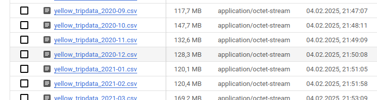
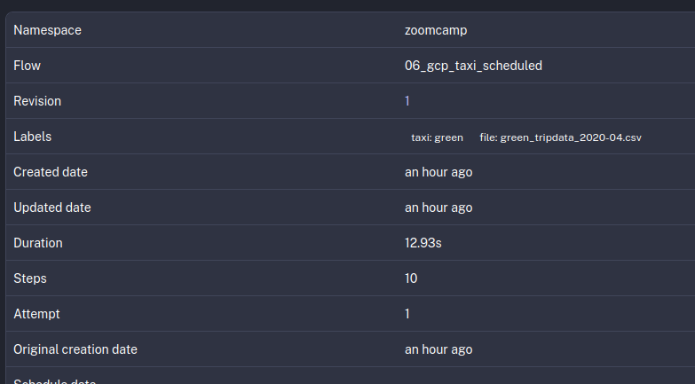

# Homework 2 - Data Engineering Zoomcamp 2025 - Workflow Orchestration

- Used Kestra's backfill functionality of the scheduled flow to upload the data for 2019 to 2021.

## Quiz questions

### 1. Within the execution for Yellow Taxi data for the year 2020 and month 12: what is the uncompressed file size (i.e. the output file yellow_tripdata_2020-12.csv of the extract task)?

The flow to ingest the data to BigQuery uploads the uncompressed csv file to the bucket we created before it is loading the data from the csv file to the BigQuery dataset. The uncompressed file size for the csv file for the yellow taxi data for the year 2020 and month 12 can be found in the bucket where the csv files where uploaded to.The answer is 128.3 MB



### 2. What is the rendered value of the variable file when the inputs taxi is set to green, year is set to 2020, and month is set to 04 during execution?

The rendered value of the `file` variable will be used as label in first task with the id `set_label`. In the Executions Overview screen for the corresponding year and month the label shows that the answer is: green_tripdata_2020-04.csv




### 3. How many rows are there for the `Yellow` Taxi data for all CSV files in the year 2020?

Executing the following SQL query on the yellow_tripdata table in the BigQuery dataset reveals that there are 24,648,499 rows for the `Yellow` Taxi data in the year 2020.

```sql
SELECT COUNT(*) FROM `projectname.unique_dataset_name.yellow_tripdata` WHERE filename LIKE "%2020%"
```

### 4. How many rows are there for the `Green` Taxi data for all CSV files in the year 2020?

Executing the following SQL query on the green_tripdata table in the BigQuery dataset reveals that there are 1,734,051 rows for the `Green` Taxi data in the year 2020.

```sql
SELECT COUNT(*) FROM `projectname.unique_dataset_name.green_tripdata` WHERE filename LIKE "%2020%"
```

### 5. How many rows are there for the `Yellow` Taxi data for the March 2021 CSV file?

Executing the following SQL query on the yellow_tripdata table in the BigQuery dataset reveals that there are 1,925,152 rows for the `Yellow` Taxi data in March 2021.

```sql
SELECT COUNT(*) FROM `projectname.unique_dataset_name.yellow_tripdata` WHERE filename LIKE "%2021-03%"
```

### 6. How would you configure the timezone to New York in a Schedule trigger?

According the example `A schedule that runs daily at midnight US Eastern time.` shown in the documentation for Schedule trigger at https://kestra.io/docs/workflow-components/triggers/schedule-trigger the answer is:

Add a timezone property set to America/New_York in the Schedule trigger configuration